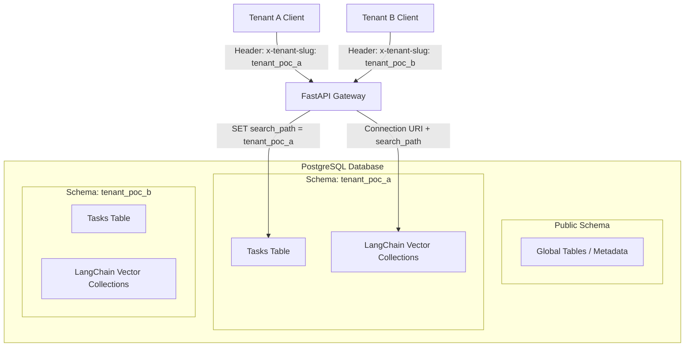

# 🌌 Multi-Tenant Vector Database: Technical Implementation Guide

This document provides a deep-dive into the architecture, implementation details, and operational workflows of the **Multi-Tenant POC**. Our goal is to achieve **zero-leakage** isolation using PostgreSQL Schemas.

---

## 🏗️ System Architecture

The application implements a **Shared Database, Separate Schema** pattern. This ensures that while we use a single physical database instance, each tenant's data is logically and physically partitioned.



---

## 🛠️ Core Isolation Mechanisms

### 1. Relational Data (SQLAlchemy)
We utilize PostgreSQL's `search_path` at the session level. Every request starts a transaction where the first command is `SET LOCAL search_path TO <tenant_slug>, public;`.

> [!IMPORTANT]
> The `LOCAL` keyword ensures that the setting is only valid for the current transaction and is cleared when the transaction ends (commit or rollback), preventing connection pool contamination.

```python
async def get_tenant_session(x_tenant_slug: str = Header(...)):
    async with AsyncSessionLocal() as session:
        # 🛡️ Tight scope: setting search_path for THIS transaction only
        await session.execute(text(f"SET LOCAL search_path TO {x_tenant_slug}, public;"))
        yield session
```

### 2. Vector Data (LangChain + PGVector)
LangChain's `PGVector` doesn't natively support dynamic schema switching via method calls. We solve this by:
1.  **Dynamic Connection Strings**: Injecting the `search_path` directly into the PostgreSQL options string.
2.  **On-the-fly Initialization**: Initializing the `PGVector` store per-request with the tenant-specific connection string.

```python
def get_tenant_connection_string(tenant: str) -> str:
    # URL-encode the search_path option
    search_path_val = f"{tenant},public"
    encoded_option = urllib.parse.quote(f"-c search_path={search_path_val}")
    return f"{SYNC_DATABASE_URL}?options={encoded_option}"
```

---

## 📡 API Specification

Every endpoint (except health checks) requires the `x-tenant-slug` header.

| Endpoint | Method | Description | Example Header |
| :--- | :--- | :--- | :--- |
| `/tasks` | `GET` | Retrieve all tasks for the tenant | `x-tenant-slug: tenant_poc_a` |
| `/vector/ingest` | `POST` | Add text embeddings to the vector store | `x-tenant-slug: tenant_poc_b` |
| `/vector/search` | `GET` | Perform similarity search on tenant's KB | `x-tenant-slug: tenant_poc_a` |
| `/debug/search-path` | `GET` | Verify actual Postgres search_path | `x-tenant-slug: tenant_poc_b` |

### Ingestion Payload
```json
{
  "text": "The secret code for Tenant B is 5678."
}
```

---

## 🧪 Validation & Testing

To guarantee isolation, we use a multi-pronged testing strategy:

````carousel
```python
# 1. Concurrent Test
# We fire multiple requests for different tenants 
# simultaneously and verify that result A 
# NEVER contains data from Tenant B.
```
<!-- slide -->
```sql
-- 2. Schema Introspection
-- We query the information_schema to ensure 
-- that tables like 'langchain_pg_collection' 
-- exist in EVERY schema, not just public.
SELECT table_schema FROM information_schema.tables 
WHERE table_name = 'langchain_pg_collection';
```
<!-- slide -->
```python
# 3. Search Path Reset Test
# We verify that after a session is returned 
# to the pool, the search_path is 'public'.
```
<!-- slide -->
```python
# 4. Connection Pool Stress Test
# We set pool_size=2 and run 100 alternating 
# requests. This proves that even when 
# connections are heavily reused, the 
# search_path is always correctly scoped.
```
````

---

## 🏁 Final Validation Result: **🟢 GO**

All 4 critical tests have passed. For a full breakdown of the test results and the final architecture decision, please refer to the **[PoC Validation Report](file:///C:/Users/user/.gemini/antigravity/brain/bb13deda-7b98-46ce-9907-e292bce49f33/poc_validation_report.md)**.

---

## 🚀 Troubleshooting & Best Practices

- **Missing Schema**: If `init_db.py` hasn't been run for a tenant, requests will fail with a `Table Not Found` error.
- **Connection Polling**: Ensure `SET LOCAL` is used, otherwise, the next user sharing that connection might see the previous tenant's data.
- **Extensions**: `CREATE EXTENSION IF NOT EXISTS vector;` must be run by a superuser in the `public` schema.

---

> [!TIP]
> Always verify that your database migrations (Alembic) are configured to iterate through all tenant schemas during updates.
